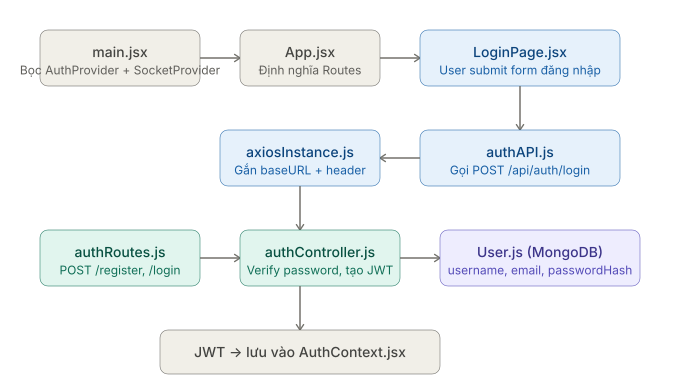
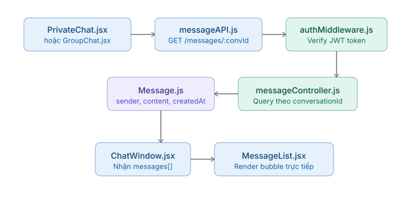
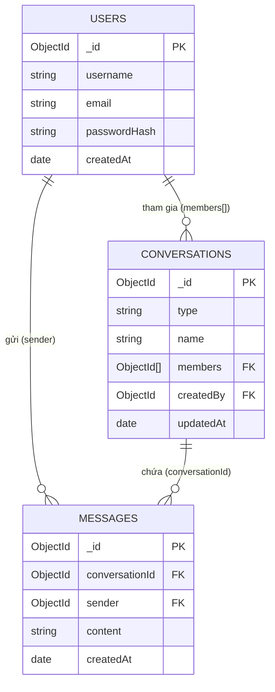

# WebChat App — Ứng Dụng Chat Thời Gian Thực

---

## Thành viên nhóm

| STT | Họ và tên | MSSV  | GitHub |
|-----|-----------|------|--------|
| 1 | Nguyễn Tấn Phát | 24521306 | [@pathbezo26](https://github.com/pathbezo26) |
| 2 | Lê Hồ Thành Phát | 24521297 | [@LEHOTHANHPHAT](https://github.com/LEHOTHANHPHAT) |
| 3 | Nguyễn Nhật Quang | 24521472 | [@nhat3911](https://github.com/nhat3911) |
| 4 | Lê Nam Khánh | 24520783 | [@maccriagor](https://github.com/maccriagor) |

---

## Mô tả tổng quan

**QikLine Chat** là một ứng dụng nhắn tin thời gian thực, cho phép người dùng trò chuyện trực tiếp theo hình thức **chat 1-1 (private)** và **chat nhóm (group)**. Ứng dụng được xây dựng theo kiến trúc client-server hiện đại, kết hợp **REST API** để xử lý dữ liệu bền vững và **Socket.IO** để truyền tin nhắn tức thời không cần reload trang.

Dự án hướng tới trải nghiệm người dùng mượt mà: đăng nhập bảo mật bằng JWT, tự động tải lịch sử trò chuyện, hiển thị tin nhắn realtime và quản lý các cuộc trò chuyện linh hoạt. Toàn bộ dữ liệu được lưu trữ trên MongoDB, đảm bảo tính bền vững và khả năng mở rộng cho hệ thống.

---

## Tính năng 

- **Đăng ký / đăng nhập bằng JWT** — backend tạo token sau khi đăng nhập, frontend lưu phiên đăng nhập trong `AuthContext`, `axiosInstance` tự gắn `Authorization: Bearer <token>` khi gọi API.
- **Khôi phục phiên đăng nhập** — khi reload trang, app kiểm tra token hiện có để giữ user đang đăng nhập và hiển thị `SplashScreen` trong lúc khôi phục.
- **Chat 1-1 realtime** — user tìm người khác, tạo private conversation và gửi tin nhắn qua Socket.IO; `ChatWindow` join room theo `conversationId`, backend broadcast `newMessage` tới room.
- **Tạo private chat nhưng không làm phiền người được chọn khi chưa nhắn** — khi bấm `Chat` sau search, conversation mới chỉ hiện ở sidebar người tạo; người được chọn được đưa tạm vào `deletedFor`, nên bên kia chưa render conversation cho tới khi có tin nhắn đầu tiên.
- **Tự hiện conversation cho người nhận khi có tin nhắn thật** — sau khi gửi message, backend cập nhật conversation và `$pull deletedFor` để conversation xuất hiện ở sidebar các thành viên liên quan.
- **Chat nhóm** — tạo group với tên nhóm, chọn nhiều thành viên, phân biệt group bằng icon trong tên nhóm và avatar chữ cái/ảnh nhóm.
- **Quản lý thành viên nhóm** — nhấn dòng số thành viên trong header group để mở drawer, tìm user để thêm vào nhóm hoặc xóa thành viên nếu có quyền.
- **Upload ảnh nhóm** — tạo nhóm có thể chọn ảnh trước, hoặc cập nhật ảnh nhóm sau; ảnh được upload bằng Multer memory và lưu Cloudinary, frontend cập nhật ảnh ở sidebar và header chat.
- **Avatar người dùng** — user có thể upload, đổi hoặc xóa avatar cá nhân; avatar được lưu metadata `{ url, publicId, updatedAt }` và hiển thị trong sidebar, message list, search result.
- **Tìm kiếm user thông minh hơn** — search không phân biệt dấu tiếng Việt và chỉ match đầu mỗi từ: `ngoc` tìm được `Ngọc Lan`, `Yến Ngọc`, `Ngoc Le`; `los` không match `carlos`.
- **Sidebar conversation list có last message** — mỗi conversation lưu `lastMessage` trực tiếp trong `Conversation`, giúp sidebar hiển thị preview nhanh mà không cần query thêm collection `messages`.
- **Sắp xếp conversation mới nhất lên đầu** — khi có tin nhắn mới, backend cập nhật `Conversation.updatedAt`, frontend nhận `conversationUpdated` rồi đưa conversation đó lên đầu sidebar.
- **Unread message count bền vững** — `Conversation.unreadCounts` lưu số tin chưa đọc theo từng user; khi có tin mới backend dùng `$inc` atomic để tránh sai count khi spam nhiều tin liên tục.
- **Reset unread khi mở conversation** — khi user chọn một conversation, frontend gọi `PATCH /api/conversations/:id/read`, backend đưa unread count của user đó về `0`.
- **Tin nhắn tới khi đang ở room khác** — sidebar vẫn nghe `conversationUpdated`, cập nhật last message, unread count và đưa conversation mới nhắn lên đầu danh sách.
- **Tin nhắn realtime trong phòng đang mở** — nếu user đang ở đúng conversation, tin mới render trực tiếp trong `MessageList` và conversation được mark read để không tăng badge không cần thiết.
- **Lịch sử tin nhắn có pagination / infinite scroll** — `GET /api/messages/:conversationId` hỗ trợ `limit` và `before`, frontend tải trang mới hơn/ cũ hơn theo cursor để không load toàn bộ lịch sử một lần.
- **Nút nhảy tới tin chưa đọc** — khi conversation có unread count, `MessageList` có thể đưa user tới khu vực tin mới/chưa đọc để đọc nhanh hơn.
- **Typing indicator** — khi user gõ, `ChatInput` emit `typing`; khi dừng gõ hoặc gửi tin thì emit `stopTyping`, bên còn lại thấy trạng thái đang nhập.
- **Xóa conversation theo từng user** — dùng `deletedFor` để ẩn conversation khỏi sidebar của user hiện tại thay vì xóa cứng dữ liệu conversation/message.
- **Delete conversation UI an toàn hơn** — menu ba chấm chỉ hiện khi hover trong sidebar, có bước xác nhận trước khi xóa conversation khỏi danh sách của user.
- **Dark mode** — bật/tắt trong Settings, lưu lựa chọn vào `localStorage`, dùng `ConfigProvider` của Ant Design để các thành phần như Popover/Drawer/Button/Input đổi theme đồng bộ.
- **UI sidebar chuyên nghiệp hơn** — hiển thị avatar, tên, icon group, last message, thời gian sát phải, unread badge nhỏ màu xám, nút ba chấm chỉ xuất hiện khi hover.
- **UI message bubble dễ đọc** — tin nhắn được nhóm theo người gửi, bubble liên tiếp có khoảng cách nhỏ hơn, avatar chỉ hiện ở tin đầu của cụm, giúp đoạn chat nhìn gọn hơn.
- **Bảo vệ Socket.IO bằng JWT** — socket kiểm tra token ngay khi kết nối; user không hợp lệ không được tham gia room hoặc gửi tin.
- **Validate dữ liệu đầu vào** — giới hạn độ dài message, giới hạn avatar/group image 2MB, chỉ nhận JPG/PNG/WEBP, kiểm tra quyền member trước khi đọc/gửi tin hoặc quản lý nhóm.

---

## Công nghệ sử dụng

### Frontend
| Công nghệ | Mục đích |
|-----------|---------|
| **ReactJS 18** | Xây dựng giao diện người dùng dạng SPA |
| **Vite** | Build tool nhanh, thay thế CRA |
| **React Router DOM** | Điều hướng giữa các trang (Login, Chat...) |
| **Axios** | Gọi REST API với interceptor tự gắn JWT |
| **Socket.IO Client** | Kết nối WebSocket với backend |
| **Context API** | Quản lý state toàn cục (Auth, Socket) |

### Backend
| Công nghệ | Mục đích |
|-----------|---------|
| **Node.js** | Runtime JavaScript phía server |
| **Express.js** | Framework xây dựng REST API |
| **Socket.IO** | Xử lý kết nối WebSocket realtime |
| **MongoDB** | Cơ sở dữ liệu NoSQL lưu trữ dữ liệu |
| **Mongoose** | ODM — định nghĩa schema và thao tác với MongoDB |
| **JWT (jsonwebtoken)** | Tạo và xác thực token xác thực |
| **bcryptjs** | Mã hóa mật khẩu người dùng |
| **Cloudinary** | Lưu trữ và tối ưu ảnh avatar |
| **Multer** | Nhận file upload (memory), giới hạn loại / dung lượng |
| **cors** | Cho phép frontend (local + Vercel) gọi API |

---

## Cấu trúc thư mục

```
QikLineChat/
├── README.md
├── docs/                                 ← Sơ đồ luồng (SVG) trong README
│   ├── flow_1_login.svg
│   ├── flow_2_load_history.svg
│   ├── flow_3_realtime_socket.svg
│   └── flow_4_create_conversation.svg
├── frontend/                             ← React + Vite
│   ├── public/
│   ├── index.html                        ← HTML entry Vite
│   ├── vite.config.js                    ← Cấu hình Vite
│   ├── eslint.config.js                  ← ESLint (flat config)
│   ├── vercel.json                       ← Cấu hình deploy Vercel
│   ├── .env.example                      ← Mẫu VITE_API_URL
│   ├── package.json
│   │
│   └── src/
│       ├── main.jsx                      ← Mount React (StrictMode), import index.css
│       ├── App.jsx                       ← AuthProvider + routes: /, /login, /register, /chat; SocketProvider bọc ChatPage
│       ├── App.css                       ← Style bổ trợ cho App
│       ├── index.css                     ← Style toàn cục / reset
│       │
│       │
│       ├── api/
│       │   ├── axiosInstance.js          ← baseURL từ VITE_API_URL, JWT interceptor, xử lý 401
│       │   ├── authAPI.js                ← Gọi /api/auth/*
│       │   ├── conversationAPI.js        ← Gọi /api/conversations/*
│       │   ├── messageAPI.js             ← Gọi /api/messages/*
│       │   └── userAPI.js                ← Avatar & username: PATCH/DELETE /api/users/me/*
│       │
│       ├── components/
│       │   ├── Sidebar.jsx               ← Danh sách hội thoại private + group
│       │   ├── SidebarSearch.jsx         ← Tìm user, bắt đầu chat 1-1 (thay thế UserSearch.jsx — đã xóa)
│       │   ├── ChatWindow.jsx            ← Khung chat đang chọn, join room socket
│       │   ├── MessageList.jsx           ← Danh sách tin nhắn theo conversation
│       │   ├── ChatInput.jsx             ← Nhập tin, gửi qua socket / API
│       │   ├── CreateGroupModal.jsx      ← Modal tạo nhóm
│       │   ├── AppNavRail.jsx            ← Thanh điều hướng / quick actions
│       │   ├── UserAvatar.jsx            ← Avatar chữ cái hoặc ảnh Cloudinary
│       │   ├── SplashScreen.jsx          ← Chờ khôi phục session khi có token
│       │   └── styles/                   ← CSS Module scoped theo component
│       │       
│       │
│       ├── pages/
│       │   ├── LoginPage.jsx             ← Form đăng nhập
│       │   ├── RegisterPage.jsx          ← Form đăng ký
│       │   ├── ChatPage.jsx              ← Layout chat: sidebar + cửa sổ chat
│       │   └── styles/                   ← CSS Module scoped theo page
│       │    
│       ├── context/
│       │   ├── AuthContext.jsx           ← Provider: user, token, login/logout
│       │   ├── AuthContextValue.js       ← Logic / state Auth tách khỏi Provider
│       │   ├── SocketContext.jsx         ← Provider socket.io-client
│       │   └── SocketContextValue.js     ← Logic kết nối socket tách khỏi Provider
│       │
│       ├── hooks/
│       │   ├── useAuth.js                ← Đọc AuthContext
│       │   └── useSocket.js              ← Đọc SocketContext
│       │
│       └── utils/
│           └── formatTime.js             ← Format thời gian hiển thị tin nhắn
│
└── backend/                              ← Node + Express + Socket.IO
    ├── server.js                         ← Entry duy nhất: Express, CORS, routes, HTTP + Socket.IO
    ├── package.json
    ├── .gitignore
    │
    └── src/
        ├── config/
        │   ├── db.js                     ← mongoose.connect MongoDB
        │   └── cloudinary.js             ← Cấu hình SDK Cloudinary (upload avatar)
        │
        ├── controllers/
        │   ├── authController.js         ← Đăng ký, đăng nhập, JWT
        │   ├── messageController.js      ← Lịch sử tin nhắn, lưu message
        │   ├── conversationController.js ← Danh sách / tạo conversation
        │   └── userController.js         ← Upload/xóa avatar lên Cloudinary, đổi username
        │
        ├── models/
        │   ├── User.js                   ← username, email, passwordHash, avatar { url, publicId }
        │   ├── Message.js                ← conversationId, sender, content, deletedBy[]
        │   └── Conversation.js           ← Schema: type, name, members, createdBy
        │
        ├── routes/
        │   ├── authRoutes.js             ← POST /register, /login
        │   ├── messageRoutes.js          ← GET /:conversationId, POST /
        │   ├── conversationRoutes.js     ← GET /, POST /
        │   └── userRoutes.js             ← Multer: PATCH/DELETE /me/avatar, PATCH /me/username, GET /search
        │
        ├── middleware/
        │   └── authMiddleware.js         ← verify JWT (Bearer)
        │
        └── socket/
            └── socketHandler.js          ← joinRoom, sendMessage, typing, online/offline, …
```

---

## Sơ đồ luồng hoạt động

### Luồng 1 — Khởi Động App & Đăng Nhập



---

### Luồng 2 — Tải Lịch Sử Chat (REST API)



---

### Luồng 3 — Gửi & Nhận Tin Nhắn Realtime (Socket.IO)



---

### Luồng 4 — Tạo Private Chat & Group Chat



> **Điểm hay:** Sau khi có `conversationId`, cả private lẫn group chat đều dùng **cùng một cơ chế** — `ChatWindow.jsx` join room socket và `socketHandler.js` broadcast theo room, không cần phân biệt loại chat.

---

## Hướng dẫn cài đặt & chạy dự án

### Yêu cầu môi trường

| Công cụ | Phiên bản tối thiểu |
|---------|---------------------|
| Node.js | >= 18.x |
| npm | >= 9.x |
| MongoDB | >= 6.x (local hoặc Atlas) |
| Git | Bất kỳ |

---

### 1. Clone repository

```bash
git clone https://github.com/pathbezo26/NT208_LTWeb_QikLineChat.git
cd QikLineChat
```

---

### 2. Cài đặt & cấu hình backend

```bash
# Di chuyển vào thư mục backend
cd backend

# Cài đặt dependencies
npm install
```

Tạo file `.env` trong thư mục `backend/`:

```env
# Cổng chạy server
PORT=5000

# Chuỗi kết nối MongoDB (local hoặc Atlas)
MONGO_URI=mongodb://localhost:27017/webchat

# Khóa bí mật để ký JWT (đặt chuỗi ngẫu nhiên dài)
JWT_SECRET=your_super_secret_key_here

# Thời gian hết hạn JWT
JWT_EXPIRES_IN=7d

# Cloudinary (upload avatar) — lấy từ dashboard Cloudinary
CLOUDINARY_CLOUD_NAME=your_cloud_name
CLOUDINARY_API_KEY=your_api_key
CLOUDINARY_API_SECRET=your_api_secret
```

---

### 3. Cài đặt frontend

```bash
# Mở terminal mới, di chuyển vào thư mục frontend
cd frontend

# Cài đặt dependencies
npm install
```

Trong `frontend/`, tạo `.env` (tham chiếu `.env.example`) với biến **`VITE_API_URL`** trỏ tới API backend, ví dụ:

```env
VITE_API_URL=http://localhost:5000/api
```

`axiosInstance.js` dùng `import.meta.env.VITE_API_URL` làm `baseURL`.

---

### 4. Chạy dự án

```bash
# Terminal 1: Chạy Backend
cd backend
npm run dev      # Dùng nodemon (hot reload)
# hoặc: npm start

# Terminal 2: Chạy Frontend
cd frontend
npm run dev
```
---

### 5. Truy cập ứng dụng

---

## Cách sử dụng

1. **Đăng ký tài khoản**: Truy cập `/register`, điền thông tin và tạo tài khoản mới.
2. **Đăng nhập**: Truy cập `/login`, nhập email và mật khẩu — JWT sẽ được lưu vào `AuthContext`.
3. **Tìm người dùng**: Dùng thanh tìm kiếm trên Sidebar (`SidebarSearch`) để tìm user và bắt đầu chat 1-1.
4. **Tạo nhóm chat**: Nhấn nút "Tạo nhóm", nhập tên nhóm và chọn thành viên qua `CreateGroupModal`.
5. **Nhắn tin**: Nhập nội dung vào `ChatInput`, nhấn Enter hoặc nút gửi — tin nhắn xuất hiện realtime cho cả hai phía.
6. **Xem lịch sử**: Nhấn vào bất kỳ cuộc trò chuyện nào trong Sidebar để tải lịch sử tin nhắn.

---

## API routes

### Auth — `/api/auth`

| Method | Endpoint | Mô tả | Auth |
|--------|----------|-------|------|
| `POST` | `/api/auth/register` | Đăng ký tài khoản mới | Không |
| `POST` | `/api/auth/login` | Đăng nhập, nhận JWT | Không |

**Ví dụ body đăng ký:**
```json
{
  "username": "nguyenvana",
  "email": "a@example.com",
  "password": "123456"
}
```

**Ví dụ response đăng nhập:**
```json
{
  "token": "eyJhbGciOiJIUzI1NiIsInR5cCI6IkpXVCJ9...",
  "user": { "_id": "...", "username": "nguyenvana", "email": "a@example.com" }
}
```

---

### Conversations — `/api/conversations`

| Method | Endpoint | Mô tả | Auth |
|--------|----------|-------|------|
| `GET` | `/api/conversations` | Lấy danh sách tất cả conversations của user | Có |
| `POST` | `/api/conversations` | Tạo private hoặc group conversation | Có |

**Ví dụ body tạo private chat:**
```json
{
  "type": "private",
  "members": ["userId_B"]
}
```

**Ví dụ body tạo group chat:**
```json
{
  "type": "group",
  "name": "Nhóm Đồ Án",
  "members": ["userId_B", "userId_C", "userId_D"]
}
```

---

### Messages — `/api/messages`

| Method | Endpoint | Mô tả | Auth |
|--------|----------|-------|------|
| `GET` | `/api/messages/:conversationId` | Lấy lịch sử tin nhắn của một conversation | Có |
| `POST` | `/api/messages` | Lưu tin nhắn mới vào DB | Có |

**Ví dụ body gửi tin nhắn:**
```json
{
  "conversationId": "conv_id_here",
  "content": "Xin chào!"
}
```

> Các route cần **Auth** phải gửi kèm header: `Authorization: Bearer <JWT_TOKEN>`

---

### Users — `/api/users`

| Method | Endpoint | Mô tả | Auth |
|--------|----------|-------|------|
| `GET` | `/api/users/search?q=` | Tìm user theo username (trừ bản thân) | Có |
| `PATCH` | `/api/users/me/avatar` | Upload / đổi avatar (multipart, field `avatar`, JPG/PNG/WEBP, tối đa 2MB) | Có |
| `DELETE` | `/api/users/me/avatar` | Xóa avatar trên Cloudinary + DB | Có |
| `PATCH` | `/api/users/me/username` | Đổi username | Có |

---

## Socket events

| Event | Hướng | Mô tả |
|-------|-------|-------|
| `connection` | Client → Server | Kết nối socket, kèm `auth.token` để xác thực |
| `disconnect` | Client → Server | Ngắt kết nối socket |
| `joinRoom` | Client → Server | Vào phòng chat theo `conversationId` |
| `leaveRoom` | Client → Server | Rời khỏi phòng chat |
| `sendMessage` | Client → Server | Gửi tin nhắn mới (`{ conversationId, content }`) |
| `newMessage` | Server → Client | Broadcast tin nhắn mới đến toàn bộ room |
| `typing` | Client → Server | Thông báo đang nhập tin nhắn |
| `stopTyping` | Client → Server | Dừng nhập tin nhắn |
| `userOnline` | Server → Client | Thông báo user vừa online |
| `userOffline` | Server → Client | Thông báo user vừa offline |

**Ví dụ sử dụng phía client:**
```javascript
// Vào phòng chat
socket.emit('joinRoom', conversationId);

// Gửi tin nhắn
socket.emit('sendMessage', { conversationId, content: 'Hello!' });

// Lắng nghe tin nhắn mới
socket.on('newMessage', (message) => {
  setMessages(prev => [...prev, message]);
});
```
---
## Thiết kế cơ sở dữ liệu

### Lược đồ (schema)

Ứng dụng sử dụng **MongoDB** với 3 collection chính: `users`, `conversations`, `messages`. Dưới đây là chi tiết schema và mối quan hệ giữa các collection.

---

#### Collection: `users`

Lưu trữ thông tin tài khoản người dùng.

```javascript
// models/User.js
{
  _id:          ObjectId,          // Khóa chính, tự sinh bởi MongoDB
  username:     String,            // Tên hiển thị, bắt buộc, duy nhất
  email:        String,            // Email đăng nhập, bắt buộc, duy nhất
  passwordHash: String,            // Mật khẩu đã mã hóa bcrypt
  avatar:       { url, publicId, updatedAt }  // Ảnh đại diện trên Cloudinary (tùy chọn)
  createdAt:    Date,              // Thời điểm tạo tài khoản (timestamps)
  updatedAt:    Date               // Thời điểm cập nhật gần nhất (timestamps)
}
```

| Trường | Kiểu | Bắt buộc | Unique | Mô tả |
|--------|------|----------|--------|-------|
| `_id` | ObjectId | Có | Có | Khóa chính tự sinh |
| `username` | String | Có | Có | Tên người dùng |
| `email` | String | Có | Có | Email đăng nhập |
| `passwordHash` | String | Có | Không | Mật khẩu mã hóa bcrypt |
| `avatar` | Object | Không | Không | `url`, `publicId`, `updatedAt` (Cloudinary) |
| `createdAt` | Date | Có | Không | Tự động (Mongoose timestamps) |

> **Lưu ý về `updatedAt`**
>
> Trường `updatedAt` của `conversations` **không tự động cập nhật khi có tin nhắn mới**, vì message được lưu ở collection `messages` riêng.
>
> Vì vậy, sau khi lưu `Message`, backend cần **cập nhật thủ công `Conversation.updatedAt`** để sidebar luôn sort đúng cuộc trò chuyện mới nhất lên đầu.
>
> ```javascript
> await Conversation.findByIdAndUpdate(conversationId, {
>   updatedAt: new Date()
> });
> ```
>
> Thường xử lý trong `socketHandler.js` hoặc `messageController.js` ngay sau bước lưu message.

---

#### Collection: `conversations`

Lưu trữ thông tin các cuộc trò chuyện (private hoặc group).

```javascript
// models/Conversation.js
{
  _id:       ObjectId,            // Khóa chính
  type:      String,              // "private" | "group"
  name:      String,              // Tên nhóm (chỉ dùng cho group, null nếu private)
  members:   [ObjectId],          // Mảng _id của các thành viên → ref: "User"
  createdBy: ObjectId,            // _id của người tạo → ref: "User"
  createdAt: Date,
  updatedAt: Date                 // Cập nhật mỗi khi có tin nhắn mới (dùng để sort)
}
```

| Trường | Kiểu | Bắt buộc | Mô tả |
|--------|------|----------|-------|
| `_id` | ObjectId | Có | Khóa chính tự sinh |
| `type` | String (enum) | Có | `"private"` hoặc `"group"` |
| `name` | String | Không | Tên nhóm (bỏ trống nếu private) |
| `members` | [ObjectId] | Có | Danh sách thành viên (ref → `users`) |
| `createdBy` | ObjectId | Có | Người tạo cuộc trò chuyện (ref → `users`) |
| `updatedAt` | Date | Có | Dùng để sắp xếp sidebar theo thời gian |

---

#### Collection: `messages`

Lưu trữ toàn bộ tin nhắn của tất cả các cuộc trò chuyện.

```javascript
// models/Message.js
{
  _id:            ObjectId,       // Khóa chính
  conversationId: ObjectId,       // Thuộc cuộc trò chuyện nào → ref: "Conversation"
  sender:         ObjectId,       // Ai gửi → ref: "User"
  content:        String,         // Nội dung tin nhắn văn bản
  deletedBy:      [ObjectId],    // Người đã “ẩn” tin (soft delete phía client)
  createdAt:      Date,
  updatedAt:      Date
}
```

| Trường | Kiểu | Bắt buộc | Mô tả |
|--------|------|----------|-------|
| `_id` | ObjectId | Có | Khóa chính tự sinh |
| `conversationId` | ObjectId | Có | Thuộc conversation nào (ref → `conversations`) |
| `sender` | ObjectId | Có | Người gửi (ref → `users`) |
| `content` | String | Có | Nội dung tin nhắn văn bản |
| `deletedBy` | [ObjectId] | Không | User đã ẩn tin (không xóa bản ghi) |
| `createdAt` | Date | Có | Thời điểm gửi, dùng để sắp xếp |

---

#### Quan hệ giữa các collection



---

### Chiến lược lập chỉ mục (indexing)

Indexing giúp tăng tốc độ truy vấn MongoDB đáng kể, đặc biệt quan trọng khi dữ liệu tin nhắn tăng trưởng nhanh.

#### Index trên collection `users`

```javascript
// Đăng nhập bằng email (authController.js)
db.users.createIndex({ email: 1 }, { unique: true })  // Unique, tăng tốc login

// Đảm bảo username không trùng
db.users.createIndex({ username: 1 }, { unique: true })
```

| Index | Loại | Lý do |
|-------|------|-------|
| `email_1` | Unique | Tra cứu nhanh khi đăng nhập |
| `username_1` | Unique | Đảm bảo tên không trùng |

---

#### Index trên collection `conversations`

```javascript
// Lấy danh sách conversation của user trên Sidebar
db.conversations.createIndex({ members: 1 })

// Sắp xếp theo tin nhắn mới nhất (conversation gần đây lên đầu)
db.conversations.createIndex({ updatedAt: -1 })

// Tổ hợp: lọc theo members + sort theo thời gian (query phổ biến nhất)
db.conversations.createIndex({ members: 1, updatedAt: -1 })

// Kiểm tra private conversation đã tồn tại chưa trước khi tạo mới
db.conversations.createIndex({ type: 1, members: 1 })
```

| Index | Loại | Truy vấn được tối ưu |
|-------|------|---------------------|
| `members_1` | Single | Lấy conversations theo userId |
| `updatedAt_-1` | Single | Sort theo tin nhắn mới nhất |
| `members_1_updatedAt_-1` | Compound | Sidebar query: filter + sort |
| `type_1_members_1` | Compound | Kiểm tra private chat trùng |

---

#### Index trên collection `messages`

```javascript
// Lấy lịch sử tin nhắn của một conversation (query quan trọng nhất)
db.messages.createIndex({ conversationId: 1, createdAt: -1 })
```

| Index | Loại | Truy vấn được tối ưu |
|-------|------|---------------------|
| `conversationId_1_createdAt_-1` | Compound | Tải lịch sử tin nhắn theo thứ tự mới nhất |

---

#### Khai báo index trong Mongoose schema

```javascript
// models/Message.js — Ví dụ khai báo index trực tiếp trong schema
const MessageSchema = new mongoose.Schema(
  {
    conversationId: { type: ObjectId, ref: 'Conversation', required: true },
    sender:         { type: ObjectId, ref: 'User', required: true },
    content:        { type: String, required: true },
  },
  { timestamps: true }
);

// Compound index: tối ưu truy vấn lịch sử chat
MessageSchema.index({ conversationId: 1, createdAt: -1 });

// models/Conversation.js
const ConversationSchema = new mongoose.Schema(
  {
    type:      { type: String, enum: ['private', 'group'], required: true },
    name:      { type: String },
    members:   [{ type: ObjectId, ref: 'User', required: true }],
    createdBy: { type: ObjectId, ref: 'User' },
  },
  { timestamps: true }
);

// Compound index: sidebar query (filter members + sort by latest)
ConversationSchema.index({ members: 1, updatedAt: -1 });
ConversationSchema.index({ type: 1, members: 1 });
```

---

#### Tóm tắt index

```
Collection: users
  ├── email_1           (unique)     ← đăng nhập
  └── username_1        (unique)     ← đảm bảo không trùng

Collection: conversations
  ├── members_1_updatedAt_-1         ← sidebar (chính)
  └── type_1_members_1               ← kiểm tra private trùng

Collection: messages
  └── conversationId_1_createdAt_-1  ← tải lịch sử (chính)
```

> **Lưu ý:** Không nên tạo quá nhiều index vì mỗi index tốn thêm dung lượng lưu trữ và làm chậm thao tác **write** (insert/update). Chỉ index những trường thực sự được dùng trong điều kiện `find()`, `sort()`, và `$lookup`.

---

## Hướng phát triển

Các tính năng có thể bổ sung trong các phiên bản tiếp theo:

- **Emoji & reaction** — emoji picker và react vào tin nhắn
- **Gửi hình ảnh / file trong cuộc trò chuyện** — ngoài avatar đã có trên hồ sơ
- **Thông báo đẩy (push)** — nhận thông báo kể cả khi không mở tab
- **Trạng thái tin nhắn** — đã gửi / đã nhận / đã đọc
- **Dark mode** — giao diện tối
- **Tìm kiếm tin nhắn** — trong lịch sử trò chuyện
- **Hồ sơ người dùng** — bio, thông tin bổ sung (avatar / đổi tên đã có)
- **Gọi video / audio** — WebRTC
- **Ghim tin nhắn** — trong nhóm
- **Thu hồi / xóa tin nhắn** — sau khi đã gửi

---


Dự án được phát triển phục vụ mục đích học tập. Mọi đóng góp và cải tiến đều được chào đón!

---

<div align="center">
  <strong>Nhóm 18</strong> · 2026
</div>
