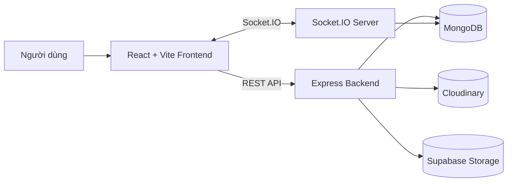
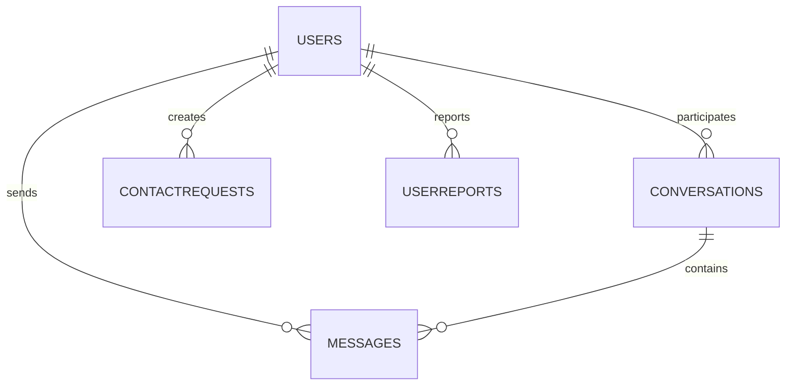

# QikLine Chat - Ứng dụng chat thời gian thực

QikLine Chat là đồ án xây dựng ứng dụng nhắn tin thời gian thực theo mô hình client-server. Hệ thống hỗ trợ đăng ký, đăng nhập, quản lý liên hệ, chat 1-1, chat nhóm, gửi file/ảnh, tìm kiếm tin nhắn và cập nhật trạng thái hội thoại realtime bằng Socket.IO.

## Thông tin đồ án

| Nội dung | Thông tin |
| --- | --- |
| Tên dự án | QikLine Chat |
| Môn học | Lập trình Web |
| Loại dự án | Web chat realtime |
| Repository | https://github.com/pathbezo26/NT208_LTWeb_QikLineChat |
| Slide thuyết trình | [docs/slides.md](./docs/slides.md) |
| Frontend demo | https://nt208-qikline.vercel.app |

## Thành viên nhóm

| STT | Họ và tên | MSSV | GitHub |
| --- | --- | --- | --- |
| 1 | Nguyễn Tấn Phát | 24521306 | [@pathbezo26](https://github.com/pathbezo26) |
| 2 | Lê Hồ Thành Phát | 24521297 | [@LEHOTHANHPHAT](https://github.com/LEHOTHANHPHAT) |
| 3 | Nguyễn Nhật Quang | 24521472 | [@nhat3911](https://github.com/nhat3911) |
| 4 | Lê Nam Khánh | 24520783 | [@maccriagor](https://github.com/maccriagor) |

## Mục tiêu dự án

QikLine Chat được phát triển nhằm mô phỏng một nền tảng nhắn tin hiện đại, nơi người dùng có thể giao tiếp trực tiếp, quản lý quan hệ liên hệ và trao đổi tài nguyên trong các cuộc trò chuyện. Dự án tập trung vào ba mục tiêu chính:

- Xây dựng giao diện chat mượt, dễ sử dụng, có trải nghiệm gần với các ứng dụng nhắn tin thực tế.
- Kết hợp REST API và Socket.IO để vừa đảm bảo lưu trữ dữ liệu bền vững, vừa cập nhật tin nhắn realtime.
- Tổ chức backend có xác thực JWT, phân quyền theo thành viên hội thoại, validate dữ liệu, upload file và xử lý lỗi rõ ràng.

## Tính năng chính

- Đăng ký, đăng nhập và khôi phục phiên bằng JWT.
- Cập nhật hồ sơ cá nhân, đổi tên hiển thị, đổi User ID, upload/xóa avatar.
- Tìm kiếm người dùng theo tên hoặc `@userId`.
- Gửi, nhận tin nhắn realtime trong chat 1-1 và chat nhóm.
- Tạo nhóm, cập nhật thông tin nhóm, ảnh nhóm, thêm/xóa thành viên, phân quyền admin/chủ nhóm.
- Gửi nhiều ảnh/file trong một tin nhắn, preview trước khi gửi và xem lại tài nguyên đã chia sẻ.
- Tìm kiếm nội dung trong từng cuộc trò chuyện, highlight và nhảy tới tin nhắn gốc.
- Hiển thị trạng thái sent, delivered, read, unread count, typing indicator, online/offline và last seen.
- Xóa tin nhắn theo chế độ xóa cho bản thân hoặc thu hồi cho mọi người.
- Xóa/ẩn cuộc trò chuyện theo từng user mà không làm mất dữ liệu của người khác.
- Ghim tin nhắn và reaction tin nhắn.
- Quản lý danh bạ: gửi, chấp nhận, từ chối, hủy lời mời kết bạn và xóa liên hệ.
- Block/report user để tăng quyền riêng tư và an toàn.
- Drawer chi tiết hội thoại hiển thị thành viên, nhóm chung, media, file và link.
- Dark mode, skeleton loading, optimistic UI, retry khi gửi lỗi và giao diện responsive.

## Công nghệ sử dụng

### Frontend

| Công nghệ | Vai trò |
| --- | --- |
| React 19 | Xây dựng giao diện SPA |
| Vite | Dev server và build tool |
| React Router DOM | Điều hướng trang đăng nhập, đăng ký, chat |
| Ant Design | Component UI |
| Axios | Gọi REST API |
| Socket.IO Client | Kết nối realtime với backend |
| Context API | Quản lý trạng thái Auth và Socket |
| CSS Modules | Tách style theo component |

### Backend

| Công nghệ | Vai trò |
| --- | --- |
| Node.js | Runtime server |
| Express.js | Xây dựng REST API |
| Socket.IO | Giao tiếp realtime |
| MongoDB | Cơ sở dữ liệu NoSQL |
| Mongoose | ODM cho MongoDB |
| JWT | Xác thực người dùng |
| bcryptjs | Mã hóa mật khẩu |
| Multer | Nhận file upload |
| Cloudinary | Lưu avatar và ảnh nhóm |
| Supabase Storage | Lưu file đính kèm |
| Helmet, CORS, Rate Limit | Bảo mật API cơ bản |

## Kiến trúc tổng quan



Frontend chịu trách nhiệm hiển thị giao diện, quản lý trạng thái phiên đăng nhập và kết nối socket. Backend cung cấp REST API cho dữ liệu bền vững, đồng thời dùng Socket.IO để broadcast tin nhắn, trạng thái đọc, typing và online/offline trong từng room hội thoại.

## Cấu trúc thư mục

```text
QikLineChat/
├── README.md
├── docs/
│   ├── slides.md
│   ├── flow_1_login.svg
│   ├── flow_2_load_history.svg
│   ├── flow_3_realtime_socket.svg
│   └── flow_4_create_conversation.svg
├── backend/
│   ├── .env.example
│   ├── package.json
│   ├── package-lock.json
│   ├── server.js
│   ├── scripts/
│   │   ├── seedChat.js
│   │   └── seedUsers.js
│   └── src/
│       ├── config/
│       │   ├── cloudinary.js
│       │   ├── corsOptions.js
│       │   ├── db.js
│       │   └── supabase.js
│       ├── controllers/
│       │   ├── authController.js
│       │   ├── conversationController.js
│       │   ├── messageController.js
│       │   └── userController.js
│       ├── middleware/
│       │   ├── authMiddleware.js
│       │   ├── errorHandler.js
│       │   ├── rateLimiters.js
│       │   └── requestLogger.js
│       ├── models/
│       │   ├── ContactRequest.js
│       │   ├── Conversation.js
│       │   ├── Message.js
│       │   ├── User.js
│       │   └── UserReport.js
│       ├── routes/
│       │   ├── authRoutes.js
│       │   ├── conversationRoutes.js
│       │   ├── messageRoutes.js
│       │   └── userRoutes.js
│       ├── socket/
│       │   └── socketHandler.js
│       └── utils/
│           ├── conversationMeta.js
│           ├── logger.js
│           └── runtimeMetrics.js
└── frontend/
    ├── .env.example
    ├── README.md
    ├── eslint.config.js
    ├── index.html
    ├── package.json
    ├── package-lock.json
    ├── vercel.json
    ├── vite.config.js
    ├── public/
    │   ├── favicon.svg
    │   ├── icons.svg
    │   └── qikline_logo.svg
    └── src/
        ├── App.css
        ├── App.jsx
        ├── index.css
        ├── main.jsx
        ├── api/
        │   ├── authAPI.js
        │   ├── axiosInstance.js
        │   ├── conversationAPI.js
        │   ├── messageAPI.js
        │   └── userAPI.js
        ├── assets/
        │   ├── hero.png
        │   ├── logo.png
        │   ├── react.svg
        │   └── vite.svg
        ├── components/
        │   ├── AppNavRail.jsx
        │   ├── ChatInput.jsx
        │   ├── ChatWindow.jsx
        │   ├── ContactsWorkspace.jsx
        │   ├── CreateGroupModal.jsx
        │   ├── GroupDetailsDrawer.jsx
        │   ├── MessageList.jsx
        │   ├── MessageSearchDrawer.jsx
        │   ├── PrivateDetailsDrawer.jsx
        │   ├── Sidebar.jsx
        │   ├── SidebarSearch.jsx
        │   ├── SplashScreen.jsx
        │   ├── UserAvatar.jsx
        │   └── styles/
        │       ├── AppNavRail.module.css
        │       ├── ChatInput.module.css
        │       ├── ChatWindow.module.css
        │       ├── ContactsWorkspace.module.css
        │       ├── CreateGroupModal.module.css
        │       ├── GroupDetailsDrawer.module.css
        │       ├── MessageList.module.css
        │       ├── MessageSearchDrawer.module.css
        │       ├── PrivateDetailsDrawer.module.css
        │       ├── Sidebar.module.css
        │       ├── SidebarSearch.module.css
        │       └── SplashScreen.module.css
        ├── context/
        │   ├── AuthContext.jsx
        │   ├── AuthContextValue.js
        │   ├── SocketContext.jsx
        │   └── SocketContextValue.js
        ├── hooks/
        │   ├── useAuth.js
        │   └── useSocket.js
        ├── pages/
        │   ├── ChatPage.jsx
        │   ├── LoginPage.jsx
        │   ├── RegisterPage.jsx
        │   └── styles/
        │       ├── AuthPage.module.css
        │       └── ChatPage.module.css
        └── utils/
            ├── fileNameEncoding.js
            └── formatTime.js
```

## Sơ đồ luồng hoạt động

### 1. Khởi động app và đăng nhập


### 2. Tải lịch sử chat bằng REST API


### 3. Gửi và nhận tin nhắn realtime


### 4. Tạo private chat và group chat


## Hướng dẫn cài đặt

### Yêu cầu môi trường

| Công cụ | Phiên bản khuyến nghị |
| --- | --- |
| Node.js | >= 18 |
| npm | >= 9 |
| MongoDB | Local hoặc MongoDB Atlas |
| Git | Bất kỳ phiên bản ổn định |

### 1. Clone repository

```bash
git clone https://github.com/pathbezo26/NT208_LTWeb_QikLineChat.git
cd NT208_LTWeb_QikLineChat
```

### 2. Cài đặt backend

```bash
cd backend
npm install
```

Tạo file `backend/.env` dựa trên `backend/.env.example`:

```env
PORT=5000
MONGO_URI=<your-mongodb-uri>
JWT_SECRET=<your-jwt-secret>
JWT_EXPIRES_IN=7d
CORS_ORIGINS=http://localhost:5173,https://nt208-qikline.vercel.app

CLOUDINARY_CLOUD_NAME=<your-cloudinary-cloud-name>
CLOUDINARY_API_KEY=<your-cloudinary-api-key>
CLOUDINARY_API_SECRET=<your-cloudinary-api-secret>

SUPABASE_URL=<your-supabase-url>
SUPABASE_SERVICE_ROLE_KEY=<your-supabase-service-role-key>
SUPABASE_FILE_BUCKET=<your-supabase-file-bucket>
```

Chạy backend:

```bash
npm run dev
```

Backend mặc định chạy tại:

```text
http://localhost:5000
```

### 3. Cài đặt frontend

```bash
cd frontend
npm install
```

Tạo file `frontend/.env` dựa trên `frontend/.env.example`:

```env
VITE_SOCKET_URL=http://localhost:5000
VITE_API_URL=http://localhost:5000/api
```

Chạy frontend:

```bash
npm run dev
```

Frontend mặc định chạy tại:

```text
http://localhost:5173
```

## Scripts

### Backend

| Lệnh | Mô tả |
| --- | --- |
| `npm run dev` | Chạy server bằng nodemon |
| `npm start` | Chạy server bằng Node.js |
| `npm run seed:users` | Tạo dữ liệu user mẫu |
| `npm run seed:users:1000` | Tạo 1000 user mẫu |
| `npm run seed:chat` | Tạo dữ liệu chat mẫu |
| `npm run seed:chat:append` | Thêm dữ liệu chat mẫu |
| `npm run seed:chat:reset` | Reset và tạo lại dữ liệu chat mẫu |

### Frontend

| Lệnh | Mô tả |
| --- | --- |
| `npm run dev` | Chạy Vite dev server |
| `npm run build` | Build production |
| `npm run preview` | Xem bản build production |
| `npm run lint` | Kiểm tra ESLint |

## API chính

Các API yêu cầu đăng nhập cần gửi header:

```http
Authorization: Bearer <JWT_TOKEN>
```

### Auth

| Method | Endpoint | Mô tả | Auth |
| --- | --- | --- | --- |
| `POST` | `/api/auth/register` | Đăng ký tài khoản | Không |
| `POST` | `/api/auth/login` | Đăng nhập và nhận JWT | Không |
| `GET` | `/api/auth/me` | Lấy thông tin user hiện tại | Có |

### Conversations

| Method | Endpoint | Mô tả | Auth |
| --- | --- | --- | --- |
| `GET` | `/api/conversations` | Lấy danh sách hội thoại | Có |
| `GET` | `/api/conversations/:id` | Lấy chi tiết hội thoại | Có |
| `POST` | `/api/conversations` | Tạo private/group conversation | Có |
| `DELETE` | `/api/conversations/:id` | Ẩn/xóa hội thoại với user hiện tại | Có |
| `PATCH` | `/api/conversations/:id/read` | Đánh dấu đã đọc | Có |
| `PATCH` | `/api/conversations/:id/avatar` | Cập nhật ảnh nhóm | Có |
| `PATCH` | `/api/conversations/:id/details` | Cập nhật tên/thông tin nhóm | Có |
| `PUT` | `/api/conversations/:id/add` | Thêm thành viên nhóm | Có |
| `PUT` | `/api/conversations/:id/remove` | Xóa thành viên nhóm | Có |
| `PUT` | `/api/conversations/:id/admins` | Cập nhật admin nhóm | Có |
| `PUT` | `/api/conversations/:id/owner` | Chuyển quyền chủ nhóm | Có |
| `PUT` | `/api/conversations/:id/leave` | Rời nhóm | Có |

### Messages

| Method | Endpoint | Mô tả | Auth |
| --- | --- | --- | --- |
| `GET` | `/api/messages/:conversationId` | Lấy lịch sử tin nhắn | Có |
| `GET` | `/api/messages/:conversationId/search` | Tìm kiếm tin nhắn | Có |
| `GET` | `/api/messages/:conversationId/pinned` | Lấy tin nhắn đã ghim | Có |
| `GET` | `/api/messages/:conversationId/shared-resources` | Lấy media/file/link đã chia sẻ | Có |
| `POST` | `/api/messages` | Gửi tin nhắn mới | Có |
| `POST` | `/api/messages/:conversationId/attachments` | Upload file đính kèm | Có |
| `PATCH` | `/api/messages/:messageId/pin` | Ghim/bỏ ghim tin nhắn | Có |
| `PATCH` | `/api/messages/:messageId/reactions` | Thêm/xóa reaction | Có |
| `DELETE` | `/api/messages/:messageId` | Xóa hoặc thu hồi tin nhắn | Có |

### Users

| Method | Endpoint | Mô tả | Auth |
| --- | --- | --- | --- |
| `GET` | `/api/users/search?q=` | Tìm kiếm user | Có |
| `PATCH` | `/api/users/me/avatar` | Upload avatar | Có |
| `PATCH` | `/api/users/me/avatar/crop` | Cập nhật crop avatar | Có |
| `DELETE` | `/api/users/me/avatar` | Xóa avatar | Có |
| `PATCH` | `/api/users/me/username` | Đổi tên hiển thị | Có |
| `PATCH` | `/api/users/me/user-id` | Đổi User ID | Có |
| `GET` | `/api/users/contacts` | Lấy danh bạ | Có |
| `POST` | `/api/users/:id/contact-request` | Gửi lời mời kết bạn | Có |
| `POST` | `/api/users/contact-requests/:requestId/accept` | Chấp nhận lời mời | Có |
| `POST` | `/api/users/contact-requests/:requestId/decline` | Từ chối lời mời | Có |
| `DELETE` | `/api/users/contact-requests/:requestId` | Hủy lời mời đã gửi | Có |
| `DELETE` | `/api/users/:id/contact` | Xóa liên hệ | Có |
| `POST` | `/api/users/:id/block` | Chặn user | Có |
| `DELETE` | `/api/users/:id/block` | Bỏ chặn user | Có |
| `POST` | `/api/users/:id/report` | Báo cáo user | Có |

### System

| Method | Endpoint | Mô tả |
| --- | --- | --- |
| `GET` | `/api/health` | Kiểm tra trạng thái server và database |
| `GET` | `/api/metrics` | Xem runtime metrics, có thể bảo vệ bằng `MONITORING_TOKEN` |

## Socket.IO events

| Event | Hướng | Mô tả |
| --- | --- | --- |
| `connection` | Client -> Server | Kết nối socket kèm JWT |
| `disconnect` | Client -> Server | Ngắt kết nối |
| `joinRoom` | Client -> Server | Vào room theo `conversationId` |
| `leaveRoom` | Client -> Server | Rời room hiện tại |
| `sendMessage` | Client -> Server | Gửi tin nhắn realtime |
| `newMessage` | Server -> Client | Broadcast tin nhắn mới |
| `conversationUpdated` | Server -> Client | Cập nhật sidebar, last message, unread count |
| `markMessagesRead` | Client -> Server | Đánh dấu tin nhắn đã đọc |
| `messageStatusUpdated` | Server -> Client | Cập nhật delivered/read |
| `typing` | Client -> Server | Báo đang nhập |
| `stopTyping` | Client -> Server | Báo dừng nhập |
| `userOnline` | Server -> Client | User online |
| `userOffline` | Server -> Client | User offline |

## Thiết kế cơ sở dữ liệu

Ứng dụng sử dụng MongoDB với các collection chính:

- `users`: thông tin tài khoản, mật khẩu đã hash, avatar, userId, danh sách block.
- `conversations`: loại hội thoại, tên nhóm, thành viên, admin, owner, last message, unread count, trạng thái ẩn/xóa theo user.
- `messages`: nội dung tin nhắn, sender, conversationId, attachments, trạng thái read/delivered, pin, reaction, delete metadata.
- `contactrequests`: lời mời kết bạn và trạng thái xử lý.
- `userreports`: dữ liệu báo cáo user.



## Bảo mật và kiểm soát dữ liệu

- Mật khẩu được hash bằng `bcryptjs`.
- JWT được kiểm tra ở cả REST API và Socket.IO.
- Middleware `protect` đảm bảo user chỉ truy cập dữ liệu được phép.
- Helmet thiết lập các HTTP security headers cơ bản.
- CORS giới hạn origin được phép gọi API/socket.
- Rate limit áp dụng cho đăng nhập, search, gửi tin và upload.
- File upload được giới hạn dung lượng và loại file.
- Tin nhắn và cuộc trò chuyện dùng soft delete để tránh mất dữ liệu ngoài ý muốn.

## Hướng phát triển

- Push notification khi người dùng không mở tab.
- Gọi audio/video bằng WebRTC.
- Mã hóa đầu cuối cho tin nhắn.
- Tìm kiếm toàn cục trên nhiều hội thoại.
- Dashboard quản trị báo cáo user và thống kê hệ thống.
- Kiểm thử tự động cho API, socket và luồng UI quan trọng.

## Ghi chú nộp báo cáo

- Link repository đã được đặt trong phần **Thông tin đồ án**.
- File slide markdown nằm tại [docs/slides.md](./docs/slides.md). Nếu nhóm dùng Canva, Google Slides hoặc một công cụ xuất slide online, chỉ cần thay link này bằng URL slide chính thức.
- Khi public repository, không commit file `.env`; chỉ commit `.env.example`.

---

<div align="center">
  <strong>Nhóm 18 - QikLine Chat</strong><br />
  Lập trình Web, 2026
</div>
